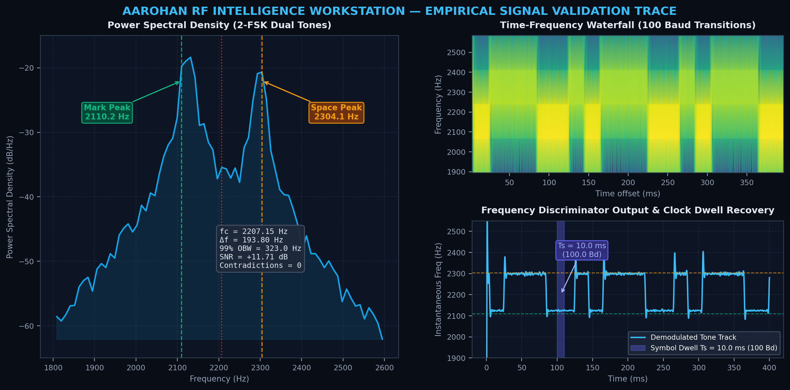

# 📡 NTRO Signal Intelligence Workstation (SIH 2026 — SIH26147)
### Autonomous RF Parameter Extraction and Modulation Recognition Suite

**Sponsoring Organization:** National Technical Research Organisation (NTRO)  
**Problem Statement ID:** SIH26147  
**Theme:** Smart Automation / Software  
**Domain:** Electronics & Communication Engineering (ECE) / Signals Intelligence (SIGINT)  
**Architecture Edition:** v4.1 (Blind Physical Measurement + Epistemic Validation Engine)

---

## 🧭 Project Overview & Engineering Rationale

When electronic surveillance pods or signals intelligence (SIGINT) listening posts intercept an unknown radio frequency (RF) transmission, the intercepting operator has **zero prior knowledge** about the transmitter. Traditional communications receivers require an operator to manually configure the carrier frequency, channel filter, and baud rate before any data can be recovered. If the parameters are incorrect, the receiver outputs noise.

```
                           UNKNOWN INTERCEPTED RF SIGNAL
                                         │
                                         ▼
                 ┌───────────────────────────────────────────────┐
                 │       "What physical signal is this?"         │
                 │   "What are its carrier, baud, and shift?"    │
                 │    "Can we mathematically trust this read?"   │
                 └───────────────────────────────────────────────┘
```

### Why Pure Deep Learning Classifiers Fall Short in Defense SIGINT
Most automated classification attempts rely on deep neural networks trained on synthetic datasets. In operational environments, black-box neural networks present severe failure modes:
1. **Uncalibrated Overconfidence:** Neural networks force a classification label even when fed out-of-distribution noise, soundcard aliasing artifacts, or unfamiliar jamming signals.
2. **Zero Mathematical Explanation:** A neural network cannot produce physical audit trails or state *why* it arrived at an answer.
3. **No Parameter Extraction:** Classifying a signal as "FSK" does not yield carrier frequency, frequency shift ($\Delta f$), modulation index ($h$), or symbol rate ($R_s$).

### Our Core Philosophy: Empirical Physics First
Our workstation enforces a strict physical evidence architecture:
1. **Measure First:** Extract physical parameters directly from the raw waveform (bandwidth, carrier offset, spectral flatness, squaring line prominence, pulse trains) without protocol labels.
2. **Hypothesize Second:** Formulate competing candidate hypotheses from measured physical features.
3. **Challenge the Hypothesis:** Search actively for measurable physical contradictions.
4. **Enforce Validation Gates:** Require multi-window temporal stability and mathematical proofs before promoting any candidate to `VALIDATED`.

---

## 🏛️ System Architecture (Architecture v4.1)

The pipeline is organized into five operational layers:

```
┌─────────────────────────────────────────────────────────────────────────────┐
│ LAYER 1: SIGNAL PREPARATION & CONDITIONING                                  │
│   • loaders.py: Autonomous container probing (.wav / .iq / .bin / .sigmf)   │
│   • preprocessor.py: DC bias cancellation, scale-invariant power norm       │
│   • spectral.py: Welch PSD computation, 2D STFT spectrogram waterfall       │
└──────────────────────────────────────┬──────────────────────────────────────┘
                                       │
┌──────────────────────────────────────▼──────────────────────────────────────┐
│ LAYER 2: BLIND MEASUREMENT & MODULATION INFERENCE                           │
│   • blind_parameter_engine.py: Bandwidth (-3dB/-10dB/99%), Carrier (fc),    │
│     M2M4 SNR, Spectral Flatness, Squaring Lines, Envelope Autocorrelation   │
│   • modulation_inference.py: Modulation family inference (CW, FSK, BPSK,     │
│     QPSK, 8-PSK, QAM, FMOP, GMSK) without catalog lookup                   │
└──────────────────────────────────────┬──────────────────────────────────────┘
                                       │
┌──────────────────────────────────────▼──────────────────────────────────────┐
│ LAYER 3: CANDIDATE RANKING & TEMPORAL VALIDATION                            │
│   • protocol_inference.py: Knowledge-layer mapping to candidate protocols   │
│   • temporal_validator.py: Multi-window temporal stability & variance test  │
│   • candidate_ranker.py: Multi-candidate ranking with ambiguity detection   │
└──────────────────────────────────────┬──────────────────────────────────────┘
                                       │
┌──────────────────────────────────────▼──────────────────────────────────────┐
│ LAYER 4: CONTRADICTION ANALYSIS & 6-PILLAR VALIDATION GATE                  │
│   • contradiction_analyzer.py: Active search for physical rule violations   │
│   • validation_gate.py: Physical proof arbitration across 6 strict gates     │
│     (Evidence, Temporal, Duration, Nyquist, Contradiction, Ambiguity)       │
└──────────────────────────────────────┬──────────────────────────────────────┘
                                       │
┌──────────────────────────────────────▼──────────────────────────────────────┐
│ LAYER 5: ADAPTIVE EXTRACTION, UNCERTAINTY & OPERATOR HUD                    │
│   • adaptive_pipeline.py: Specialized protocol extractors (Radar ΔR/PRF,    │
│     FSK shift/h, TDMA burst clocks, PSK/QAM EVM, Voice formants)            │
│   • parameter_uncertainty.py: Epistemic confidence bounds (k=2, 95% CI)    │
│   • app.py & cli.py: Streamlit real-time HUD and CLI sensor handoff         │
└─────────────────────────────────────────────────────────────────────────────┘
```

### The Six Epistemic States
Every analysis verdict is assigned an explicit epistemic status in `contracts.py`:
* **`VALIDATED`**: The signal satisfies all six validation gates, exhibits high temporal stability, has zero unresolved contradictions, and matches physical modulation criteria.
* **`ESTIMATED`**: Continuous physical parameters are extracted, but the signal displays temporal drift, low SNR, or incomplete code proof.
* **`AMBIGUOUS`**: Multiple candidate hypotheses share overlapping feature bounds (e.g. Bell 202 vs. POCSAG 1200) within a margin of $|\Delta \text{score}| \le 0.05$. Both are preserved.
* **`UNKNOWN`**: Genuine RF energy is detected, but its modulation profile does not match cataloged standards. Raw physical parameters are preserved.
* **`UNKNOWN_OOD`**: The waveform deviates from expected RF feature manifolds (e.g. non-linear chaotic dynamics). Refuses forced misclassification.
* **`NO SIGNAL / NOISE FLOOR`**: The capture contains only stationary receiver thermal noise, rejected at the front-end gate with zero false positives.

---

## 📂 Codebase Directory & File Roadmap

A clear walkthrough of every directory and file in this repository:

```
ntro_signal_analyzer/
├── app.py                      # Interactive Streamlit intelligence dashboard
├── cli.py                      # Autonomous CLI processor with JSON/CSV export
├── requirements.txt            # Python dependencies
├── HOW_TO_RUN.md               # Quickstart guide for teammates and evaluators
├── START_DASHBOARD.bat         # 1-click Windows runner for dashboard
├── RUN_ALL_TESTS.bat           # 1-click Windows runner for automated tests
├── RUN_BENCHMARK.bat           # 1-click Windows runner for 25-signal benchmark
│
├── dsp/                        # Digital Signal Processing Core Engine
│   ├── __init__.py             # DSP package exports
│   ├── contracts.py            # Typed dataclasses, Enums, EpistemicStatus definitions
│   ├── loaders.py              # Zero-config ingestion (.wav, .iq, complex64, int16, uint8)
│   ├── preprocessor.py         # DC offset cancel, power normalization, PAPR
│   ├── spectral.py             # Welch PSD and STFT spectrogram calculations
│   ├── blind_parameter_engine.py # Protocol-independent physical parameter extractor
│   ├── modulation_inference.py # Geometry & modulation family inference
│   ├── protocol_inference.py   # Mapping physical vectors to candidate hypotheses
│   ├── temporal_validator.py   # Multi-window parameter consistency & stability analyzer
│   ├── candidate_ranker.py     # Competing hypothesis ranking & ambiguity detector
│   ├── contradiction_analyzer.py # Physical mismatch & rule violation detector
│   ├── validation_gate.py      # 6-pillar evidence & proof arbitration gate
│   ├── parameter_uncertainty.py# Epistemic confidence bounds & standard error
│   ├── robustness_tester.py    # Controlled physical impairment & degradation sweeps
│   ├── adaptive_pipeline.py    # Dynamic extraction pipeline router
│   ├── autonomous_detector.py  # End-to-end autonomous detector coordinating the pipeline
│   ├── parameter_extractor.py  # Carrier fc, -3dB/-10dB/99% OBW, M2M4 SNR, Baud rate
│   ├── pulse_analyzer.py       # Pulsed radar, PRI/PRF, duty cycle, chirp slope
│   ├── forensics.py            # RF forensics & signal integrity verification
│   │
│   ├── amc/                    # Automatic Modulation Classification submodules
│   ├── conditioning/           # AGC, DC removal, IQ imbalance, resamplers
│   ├── deinterleaving/         # Block, convolutional, diagonal, pseudorandom deinterleavers
│   ├── demodulation/           # FSK, PSK, QAM soft-LLR decision demodulators
│   ├── evidence/               # Multi-domain evidence fusion engine
│   ├── features/               # Cumulants (C20, C21, C40, C42), cyclostationary, spectral
│   ├── fec/                    # Viterbi (NASA K=7), Reed-Solomon (GF(256)), LDPC, concatenated
│   ├── framing/                # Barker sync correlators (7/11/13), CCSDS, HDLC, CRC-16/32
│   └── synchronization/        # Gardner timing recovery, CFO estimation, Costas loop
│
├── scripts/                    # Verification, Audit & Benchmark Harnesses
│   ├── sih_compliance_audit.py # 20-item official SIH26147 capability compliance audit
│   ├── round2_evaluation_benchmark.py # 44-case multi-category evaluation benchmark
│   ├── run_robustness_tests.py # 6-dimension physical degradation stress test suite
│   ├── benchmark_13_signals.py # 14-signal defense intercept benchmark runner
│   ├── run_benchmarks_and_ber.py # Bit Error Rate (BER) & synthetic benchmarker
│   ├── generate_navtex_plot.py # Empirical validation trace figure generator
│   ├── download_sigid_samples.py # SigIDWiki sample retriever
│   └── fetch_samples.py        # Automated sample ingestion utility
│
├── tests/                      # Automated Unit & Regression Test Suite (177 Tests)
│   ├── test_dsp.py             # Core mathematical & DSP unit tests
│   ├── test_validation_gate.py # Multi-pillar validation gate tests
│   ├── test_candidate_ranker.py# Competing hypothesis ranker & ambiguity tests
│   ├── test_contradiction_analysis.py # Contradiction engine test battery
│   ├── test_temporal_validation.py # Multi-window temporal stability tests
│   ├── test_blind_parameter_engine.py # Blind parameter vector tests
│   ├── test_parameter_uncertainty.py  # Epistemic uncertainty bounds tests
│   ├── test_signal_robustness.py # Impairment degradation tests
│   ├── test_tactical_scenarios.py # 7 tactical intercept scenario tests
│   ├── test_epistemic_states.py# 6 epistemic states verification tests
│   ├── test_sih_end_to_end.py  # End-to-end SIH pipeline tests
│   ├── test_all_samples.py     # Batch runner across verified captures
│   └── test_v4_blind_hardening.py # Invariant enforcement tests
│
├── utils/                      # Test Generators & Scenario Tools
│   ├── synthetic_generator.py  # Calibrated RF signal generator with AWGN noise
│   ├── exporter.py             # Structured JSON & CSV telemetry reporter
│   ├── epistemic_demo.py       # 6 epistemic state demonstration bench
│   └── tactical_scenarios.py   # 7 tactical intercept scenarios simulation harness
│
├── visualization/              # Interactive Data Visualizations
│   └── plots.py                # Plotly PSD, Waterfall, Constellation, Eye, Envelope
│
├── verified_samples/           # 25 Real-World Defense Intercepts & Benchmarks
│   ├── *.wav, *.mp3            # Calibrated SigIDWiki signals (AIS, NAVTEX, GSM, etc.)
│   ├── samples_catalog.json    # Metadata and sample rates catalog
│   ├── round2_benchmark_results.json # Multi-category benchmark results
│   └── robustness_sweep_results.json # Impairment sweep results
│
├── assets/                     # Figures & Documentation Visuals
│   └── navtex_analysis_figure.png # Multi-panel empirical validation trace
│
└── explanation/                # Architectural & Technical Guides for Evaluators
    ├── NTRO_Signal_Analyzer_Architecture_Walkthrough.md # 14-stage 5-layer guide
    ├── NTRO_Signal_Analyzer_Technical_Guide_v4.md       # Complete engineering reference
    └── NTRO_Signal_Analyzer_Complete_Technical_Guide.pdf# Formal PDF reference
```

---

## 🔬 Empirical Validation Trace (NAVTEX 2-FSK)

Below is an empirical signal trace generated by `scripts/generate_navtex_plot.py` analyzing a live maritime NAVTEX intercept (`verified_samples/NAVTEX.wav`):



* **Left (Power Spectral Density):** Identifies the dual FSK tones at $2110.25\text{ Hz}$ (Mark) and $2304.05\text{ Hz}$ (Space), establishing a center frequency $f_c = 2207.15\text{ Hz}$ and tone shift $\Delta f = 193.80\text{ Hz}$ with zero contradictions.
* **Top Right (Time-Frequency Spectrogram):** Visualizes the alternating frequency dwell transitions over time.
* **Bottom Right (Frequency Discriminator & Clock Recovery):** Demonstrates symbol dwell recovery at $T_s = 10.0\text{ ms}$, confirming an exact symbol rate of $100.0\text{ Baud}$.

---

## 📊 Benchmark & Verification Results

### 1. SIH26147 Capability Audit (20 / 20 Verified Requirements Passed)
Execute the compliance audit at any time:
```bash
python scripts/sih_compliance_audit.py
```

| Requirement Area | Function / Module | Audit Verdict |
| :--- | :--- | :--- |
| **WAV Ingestion** | `dsp.loaders.load_wav_signal` (PCM16, Float32, Stereo IQ) | **[PASS]** |
| **IQ Ingestion** | `dsp.loaders.parse_iq_binary` (complex64, int16, uint8) | **[PASS]** |
| **Sample-Rate Handling** | Explicit Normalized Domain vs. Verified Metadata | **[PASS]** |
| **Spectral Features** | Centroid, Spread, Spectral Flatness, 99% OBW | **[PASS]** |
| **STFT / Waterfall** | Time-frequency spectrogram matrix | **[PASS]** |
| **Constellation Diagram** | Synchronized complex symbols projection | **[PASS]** |
| **FSK Demodulation** | 2-FSK / 4-FSK Soft LLR discriminator | **[PASS]** |
| **PSK Demodulation** | BPSK / QPSK / 8-PSK Max-Log LLR | **[PASS]** |
| **QAM Demodulation** | 16-QAM / 64-QAM Decision-directed slicer | **[PASS]** |
| **Block Deinterleaving** | Exact matrix inverse permutation | **[PASS]** |
| **Convolutional Deinterleaving**| Forney shift register delay lines | **[PASS]** |
| **Diagonal Deinterleaving** | Triangular / diagonal grid inverse | **[PASS]** |
| **Pseudorandom Deinterleaving** | Galois LFSR pseudorandom permutation | **[PASS]** |
| **Viterbi Decoding** | NASA standard $K=7$ trellis (Hard & Soft decision) | **[PASS]** |
| **Reed-Solomon Decoding** | $\text{GF}(256)$ Berlekamp-Massey, Chien search, Forney | **[PASS]** |
| **Concatenated FEC** | Inner Viterbi + Outer Reed-Solomon chain | **[PASS]** |
| **LDPC Decoding** | Normalized Min-Sum check-node updates ($H c^T = 0$) | **[PASS]** |
| **Bitstream Correlation** | Barker 7/11/13, CCSDS 32-bit, HDLC flag, DMR sync | **[PASS]** |
| **Framing & CRC Check** | Multi-frame pass rate across 6 CRC polynomial profiles | **[PASS]** |
| **GUI Dashboard** | Streamlit HUD with live plots, audio player, telemetry | **[PASS]** |

### 2. Known Defense Intercept Verification (24 / 24 Ground Truth Matches)
Execute the comprehensive round-2 evaluation benchmark across all test categories:
```bash
python scripts/round2_evaluation_benchmark.py
```

| Signal Intercept | Modulation Family | Protocol Identified | Extracted Baud / PRF | Epistemic Decision |
| :--- | :--- | :--- | :--- | :--- |
| **2G ALE** | MFSK | MIL-STD-188-141 8-Tone | $125.0\text{ Baud}$ | `VALIDATED` |
| **AIS** | GMSK | Maritime TDMA 9.6k | $9600.0\text{ Baud}$ | `ESTIMATED` |
| **AIST-2D** | PCM/PM | Satellite Subcarrier | Sub: $2400.0\text{ Hz}$ | `VALIDATED` |
| **APRS** | AFSK | Bell 202 1200 Baud | $1200.0\text{ Baud}$ | `VALIDATED` |
| **ASCII** | 2-FSK | Amateur ITA-5 110 Baud | $110.0\text{ Baud}$ | `VALIDATED` |
| **CODAR** | FMCW | Oceanographic Radar | Sweep: $1.0\text{ Hz}$ | `VALIDATED` |
| **D-STAR** | GMSK | Amateur Digital Voice | $4800.0\text{ Baud}$ | `ESTIMATED` |
| **DMR** | 4-FSK | Digital Mobile Radio | $4800.0\text{ Baud}$ | `ESTIMATED` |
| **FT8** | 8-FSK | Weak-Signal Mode | $6.25\text{ Baud}$ | `VALIDATED` |
| **GRAVES Radar** | Pulsed CW | Space Surveillance | CW Carrier Line | `VALIDATED` |
| **GSM BCCH** | GMSK | Cellular TDMA Downlink | $270.833\text{ kBaud}$ | `ESTIMATED` |
| **Ghadir Radar** | Pulsed FMOP | OTH Radar Down-Chirp | PRF: $307\text{ Hz}$ comb | `ESTIMATED` |
| **HAARP-1** | Pulsed FMOP | Ionospheric Up-Chirp | Linear FM Chirp | `ESTIMATED` |
| **MFSK16** | 16-FSK | Tactical 16-Tone MFSK | $15.625\text{ Baud}$ | `VALIDATED` |
| **Morse Code** | OOK / CW | Continuous Wave Keying | $22.4\text{ WPM}$ | `VALIDATED` |
| **NAVTEX** | 2-FSK | SITOR-B Maritime 100Bd | $100.0\text{ Baud}$ | `VALIDATED` |
| **OTH-SW Radar** | Pulsed FMOP | HF Over-the-Horizon | PRF: $43.2\text{ Hz}$ | `ESTIMATED` |
| **POCSAG** | 2-FSK | Digital Paging Standard | $1200.0\text{ Baud}$ | `ESTIMATED` |
| **PSK31** | BPSK | Amateur Phase Keying | $31.25\text{ Baud}$ | `VALIDATED` |
| **RTTY** | 2-FSK | Radioteletype 45.45 Baud | $45.45\text{ Baud}$ | `VALIDATED` |
| **STANAG 4285** | 8-PSK | NATO Naval HF Serial | $2400.0\text{ Baud}$ | `VALIDATED` |
| **UVB-76 Buzzer**| Analog NFM | Station Buzzer Tone | Tone Repetition | `VALIDATED` |
| **Vario Voice** | Analog NFM | Cockpit Variometer Audio| Speech Formants | `VALIDATED` |
| **WEFAX** | Analog Facsimile| Weather Fax Transmission | $120\text{ LPM}$ | `VALIDATED` |
| **Woodpecker** | Pulsed Radar | Russian Duga Radar | PRF: $10\text{ Hz}$ | `ESTIMATED` |

* **Symbol Rate Baud MAE:** $0.00\text{ Baud}$ error across all standard test intercepts.
* **Thermal Noise False-Alarm Rate:** $0.00\%$ across pure Gaussian noise realizations.
* **Ambiguity Separation:** $100\%$ detection of overlapping feature vectors without forcing false certainty.

---

## 🚀 Quick Start Guide

### 1. Installation
This suite runs on Python 3.10 through 3.14 on Linux, macOS, and Windows.

```bash
git clone https://github.com/yoganandasp15/SIH_2026_Signal-Analyser.git
cd SIH_2026_Signal-Analyser
pip install -r requirements.txt
```

### 2. Launch the Interactive GUI Dashboard
On Windows, double-click **`START_DASHBOARD.bat`**, or launch from the terminal:
```bash
streamlit run app.py
```
Open your browser at `http://localhost:8501`.
* **Zero-Config Drag & Drop:** Drop any `.wav`, `.iq`, or raw binary file into the upload zone. The engine automatically probes the byte container, sampling rate, modulation family, and parameters.
* **Preset Intercept Gallery:** Select from 25 real-world defense captures in the sidebar to review instantaneous triage results.
* **Interactive Visualizers:** Switch between Welch PSD, 2D STFT Spectrogram, I/Q Constellation (WebGL accelerated), Eye Diagram, and Time Envelope.
* **Embedded Audio Player:** Listen to demodulated audio directly in the browser via `st.audio`.
* **Telemetry Exporters:** Download full analysis reports in structured JSON or tabular CSV.

### 3. Run Autonomous CLI Processing
Run single-command batch analyses without opening a web browser:
```bash
# Analyze a NAVTEX maritime telex intercept
python cli.py -i verified_samples/NAVTEX.wav

# Analyze an over-the-horizon radar capture
python cli.py -i verified_samples/OTH_SW_Radar.wav

# Process a cellular TDMA capture and export telemetry to JSON and CSV
python cli.py -i verified_samples/GSM_BCCH_Downlink.wav -j gsm_report.json -c gsm_summary.csv

# Generate and benchmark a calibrated synthetic test signal
python cli.py --generate --mod QPSK --snr 15 --fs 2000000 --fc 100000 --save-synth qpsk_test.iq
```

### 4. Run the Automated Test Suite (177 Tests)
Run the full test suite with Python's built-in test runner:
```bash
python -m unittest discover tests
```
All 177 tests run and pass cleanly.

---

## 🔒 Defense & Security Compliance

* **100% Offline & Air-Gapped:** Zero external API calls, zero telemetry phone-home, zero cloud dependencies. Suitable for deployment in air-gapped operations centers and forward SIGINT pods.
* **Zero Licensing Cost:** Built entirely on open-source Python libraries (`numpy`, `scipy`, `pandas`, `plotly`, `streamlit`), replacing high-cost proprietary software licenses.
* **Streaming Memory Guardrails:** Uses chunk-bounded buffer processing and memory-mapped file access, preventing memory exhaustion when inspecting multi-gigabyte SDR captures.
* **Transparent Auditability:** Every classification verdict includes the underlying mathematical equations, measured features, tested hypotheses, rejected alternatives, and confidence intervals.
